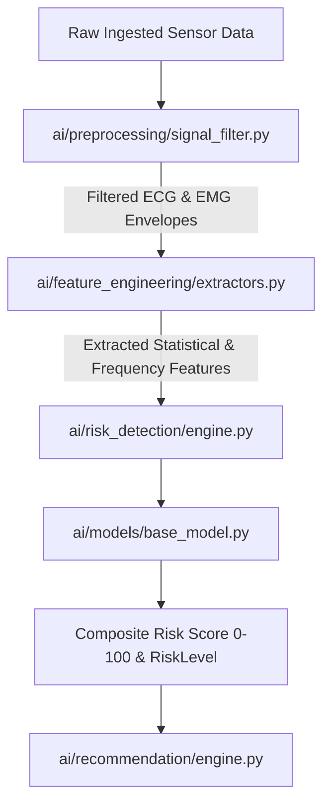

# VITA-BAND AI: Artificial Intelligence & Risk Detection Architecture

**Project**: VITA-BAND AI  
**Team**: ALPHA MECHS  
**SIH Problem Statement ID**: SIH26198  

---

## 1. Modular AI Pipeline

The VITA-BAND AI intelligence pipeline is organized under `ai/` into distinct, testable modules:

---

## 2. Signal Preprocessing & Filtering

Raw wearable biosignals are inherently corrupted by motion artifacts, baseline drift, and powerline interference.
1. **Butterworth Bandpass Filter (0.5 Hz – 45 Hz)**:
   - Attenuates respiratory baseline wander (<0.5 Hz) and high-frequency muscle tremor (>45 Hz) from the ECG trace.
2. **50 Hz IIR Notch Filter**:
   - Suppresses 50Hz AC mains electrical coupling from nearby charging devices.
3. **Full-Wave Rectification & Moving RMS Envelope**:
   - Extracts continuous muscle contraction energy from raw bipolar EMG signals.

---

## 3. Multi-Modal Feature Extraction

- **Rothfusz Heat Index ($HI$)**:
  Estimates apparent thermal danger by coupling core/skin temperature ($T$) and ambient humidity ($R$):
  $$HI = c_1 + c_2 T + c_3 R - c_4 TR - c_5 T^2 - c_6 R^2 + \dots$$
- **HRV Time-Domain Metrics**:
  - $RMSSD = \sqrt{\frac{1}{N-1} \sum_{i=1}^{N-1} (RR_{i+1} - RR_i)^2}$
  - Decreased RMSSD indicates autonomic stress and elevated sympathetic tone.
- **EMG Fatigue Index**:
  - Normalizes RMS muscle activation against baseline to detect localized muscle exhaustion ($>0.7$ high fatigue).

---

## 4. Multi-Modal Risk Scoring Formula

The composite risk score ($S_{risk} \in [0, 100]$) is computed through transparent, explainable clinical weighting:

$$S_{risk} = S_{baseline} + w_{fall} + w_{hypoxia} + w_{hr} + w_{thermal} + w_{fatigue}$$

Where:
- $w_{fall} = 85$ if fall impact detected ($>3.0g$ acceleration + immobility).
- $w_{hypoxia} = 60$ if $\text{SpO}_2 < 88\%$, $35$ if $\text{SpO}_2 < 93\%$.
- $w_{hr} = 45$ if $HR > 150 \text{ or } HR < 42$, $25$ if $HR > 115 \text{ or } HR < 52$.
- $w_{thermal} = 45$ if $T > 39.0^\circ\text{C}$, $20$ if $T > 37.8^\circ\text{C}$, $+25$ if $HI > 42^\circ\text{C}$.
- $w_{fatigue} = 20$ if $\text{Fatigue Index} > 0.70$.

### Risk Classification Tiers:
- **`NORMAL` (Score 0 – 35)**: Stable physiological equilibrium.
- **`WARNING` (Score 36 – 69)**: Early physiological or environmental strain.
- **`CRITICAL` (Score 70 – 100)**: Immediate health hazard, acute fall, or vital breach.

---

## 5. Machine Learning & Edge Model Extension

The engine provides an abstract interface `BaseRiskModel` in `ai/models/base_model.py`. This design allows seamless plugging of:
- Edge PyTorch quantized neural networks (`.pt` / `.pth`)
- TensorFlow Lite micro models (`.tflite`)
- Scikit-learn anomaly detectors (Isolation Forests, One-Class SVM)

*Note: Per SIH guidelines, model accuracy is not fabricated; baseline heuristics are 100% transparent, and trained weights can be loaded dynamically when hardware calibration datasets are integrated.*
