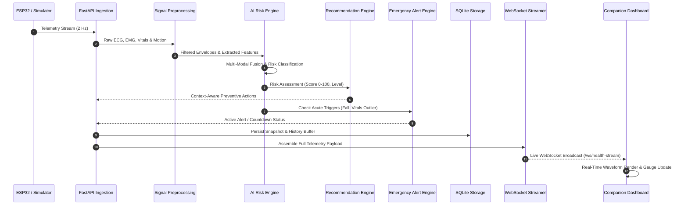

# VITA-BAND AI: Core Data Flow & Pipeline

**Project**: VITA-BAND AI  
**Team**: ALPHA MECHS  
**SIH Problem Statement ID**: SIH26198  

---

## 1. End-to-End Data Pipeline

The data flow executes seamlessly from raw acquisition through multi-stage processing to live visual presentation:

---

## 2. Ingestion & Validation Stage

1. **Ingestion Channel**:
   - In DEMO MODE: `SmartHealthSimulator` generates packets internally.
   - In HARDWARE MODE: The ESP32 sends HTTP POST `/api/sensors/ingest`.
2. **Data Validation**:
   - All payloads are strictly parsed and validated against the Pydantic `SensorReading` schema.
   - Values outside biological bounds (e.g. $HR < 30$ or $HR > 240$) are rejected with HTTP 422.

---

## 3. Storage & Dissemination Stage

- **In-Memory Ring Buffer**: Stores the latest 120 seconds of telemetry for instant retrieval and low latency.
- **Local SQLite Persistence**: Appends timestamped records to `telemetry_records` and `alert_records` for long-term health history without cloud reliance.
- **Broadcasting Engine**: Concurrently serializes and pushes updates to all connected dashboard WebSocket clients.
