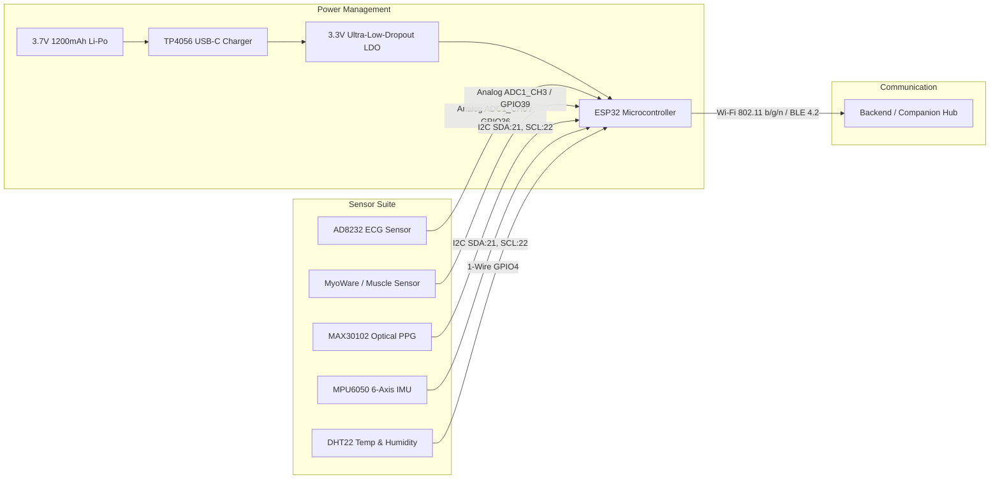

# VITA-BAND AI: Hardware Architecture & Sensor Integration

**Project**: VITA-BAND AI  
**Team**: ALPHA MECHS  
**SIH Problem Statement ID**: SIH26198  

---

## 1. Hardware Architecture Overview

The physical wearable layer of VITA-BAND AI uses the **ESP32** microcontroller as the central edge hub, interfacing with 5 physical sensor ICs across analog and digital buses.

---

## 2. Sensor Specifications & Pinout Mapping

| Sensor Module | Measured Parameters | Interface / Protocol | ESP32 Pin Mapping | Sampling Rate | Operating Voltage |
| :--- | :--- | :--- | :--- | :--- | :--- |
| **AD8232** | Lead I/II Cardiac Potential (ECG) | Analog ADC | `GPIO36` (ADC1_0), `GPIO34` (LO+), `GPIO35` (LO-) | 100 Hz | 3.3V |
| **EMG Sensor** | Muscle Fiber Contraction (uV) | Analog ADC | `GPIO39` (ADC1_3) | 100 Hz | 3.3V |
| **MAX30102** | Heart Rate (BPM) & SpO2 (%) | I2C Digital | `SDA: GPIO21`, `SCL: GPIO22`, `INT: GPIO18` | 50 Hz | 3.3V |
| **MPU6050** | 3-Axis Accel ($g$) & 3-Axis Gyro (°/s) | I2C Digital | `SDA: GPIO21`, `SCL: GPIO22`, `INT: GPIO19` | 50 Hz | 3.3V |
| **DHT22 (AM2302)** | Ambient Temp (°C) & Humidity (%) | 1-Wire Single-Bus | `DATA: GPIO4` (with 10kΩ pull-up) | 0.5 Hz | 3.3V |

---

## 3. Power Management & Continuous 24h Operation

- **Power Source**: 3.7V 1200mAh Lithium-Polymer cell.
- **Power Consumption Profile**:
  - Active Transmission Mode (Wi-Fi streaming 2Hz): ~110 mA.
  - Edge Preprocessing & BLE Mode: ~45 mA.
  - Deep Sleep Idle Mode: ~15 µA.
- **Estimated Runtime**: 18–24 hours continuous telemetry on single charge; easily extended via adaptive transmission throttling when resting.

---

## 4. Hardware vs. Simulation Mode

- **HARDWARE MODE**:
  The physical ESP32 firmware reads hardware registers, packs readings into JSON, and transmits via HTTP POST `/api/sensors/ingest` or local WebSocket.
- **DEMO / SIMULATION MODE**:
  The Smart Health Simulation Framework acts as a virtual hardware controller, synthesizing authentic physiological traces with adjustable noise and artifact models for reliable zero-hardware jury demonstration.
