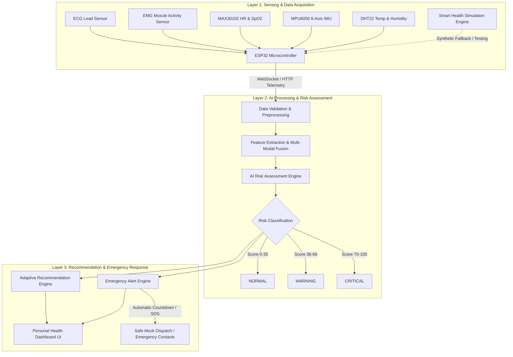

# VITA-BAND AI: System Architecture Design

**Project**: VITA-BAND AI  
**Team**: ALPHA MECHS  
**SIH Problem Statement ID**: SIH26198  

---

## 1. Overview & Three-Layer Architecture

VITA-BAND AI is designed as a secure, real-time, privacy-preserving Personal Health Companion. The system addresses continuous multi-sensor physiological and environmental monitoring, edge-optimized AI risk detection, and emergency alerting during everyday routines and disaster emergencies.

The architecture strictly follows the **Three-Layer Approach** introduced in the project specification:

---

## 2. Component Specifications

### 2.1 Layer 1: Sensing & Data Acquisition
- **ESP32 Microcontroller**: Dual-core 240MHz MCU acting as the on-body hub collecting ADC and I2C signals at 50Hz–200Hz.
- **Sensors**:
  - **ECG Sensor (AD8232)**: Single-lead cardiac electrical potential acquisition for arrhythmia and heart rate variability (HRV) analysis.
  - **EMG Sensor**: Surface electromyography for muscle strain and fatigue quantification.
  - **MAX30102**: Reflective optical photoplethysmography (PPG) measuring arterial oxygen saturation (SpO2) and pulse rate.
  - **MPU6050**: 3-axis accelerometer + 3-axis gyroscope capturing movement posture, impact vectors, and post-fall immobility.
  - **DHT22**: Calibrated digital ambient temperature and humidity for environmental heat stress calculations.
- **Smart Health Simulation Framework**: Provides deterministic synthetic streams covering 8 physiological stress conditions for AI training, regression testing, and live demonstrations without physical hardware dependency.

### 2.2 Layer 2: AI Processing & Risk Assessment
- **Signal Preprocessing**: Butterworth bandpass filter (0.5–45Hz) for ECG baseline wander removal, 50Hz notch filter, moving RMS rectification for EMG, acceleration magnitude vector computation:
  $$||\vec{a}|| = \sqrt{a_x^2 + a_y^2 + a_z^2}$$
- **Multi-Modal Data Fusion**: Merges cardiac rhythm, respiratory oxygenation, thermoregulatory state, muscle strain, and kinetic movement.
- **Transparent Risk Scoring**: Calculates a composite 0–100 risk index based on weighted clinical bounds (normal, warning, critical) combined with an extensible machine learning model interface.

### 2.3 Layer 3: Recommendation & Emergency Response
- **Recommendation Engine**: Generates evidence-based, non-diagnostic wellness and early-warning actions (e.g. hydration protocols, heat stress reduction, resting phases).
- **Emergency Alert Engine**: Detects acute events (impact > 3.0g + inactivity = Fall; SpO2 < 85% or extreme tachycardia = Critical Vitals; Manual SOS). Initiates a 15-second visual/audio countdown allowing the user to dismiss false alarms before triggering emergency contact dispatch.
- **Personal Health Dashboard**: Ultra-modern, responsive Web application displaying live waveforms, vital gauges, risk alerts, and simulation control switches.

---

## 3. Data Contracts & Interfaces

| Component | Protocol | Endpoint / Channel | Payload Schema |
| :--- | :--- | :--- | :--- |
| ESP32 Ingest | HTTP POST | `/api/sensors/ingest` | `SensorReading` |
| Live Dashboard | WebSocket | `/ws/health-stream` | `WebSocketTelemetryPayload` |
| Risk Query | HTTP GET | `/api/risk/current` | `RiskAssessment` |
| Recommendations | HTTP GET | `/api/recommendations` | `List[Recommendation]` |
| Simulation Control | HTTP POST | `/api/simulation/start` | `SimulationStartRequest` |
| Emergency Alert Test | HTTP POST | `/api/alerts/test` | `AlertTestRequest` |
| Alert Acknowledge | HTTP POST | `/api/alerts/acknowledge` | `AlertAcknowledgeRequest` |
