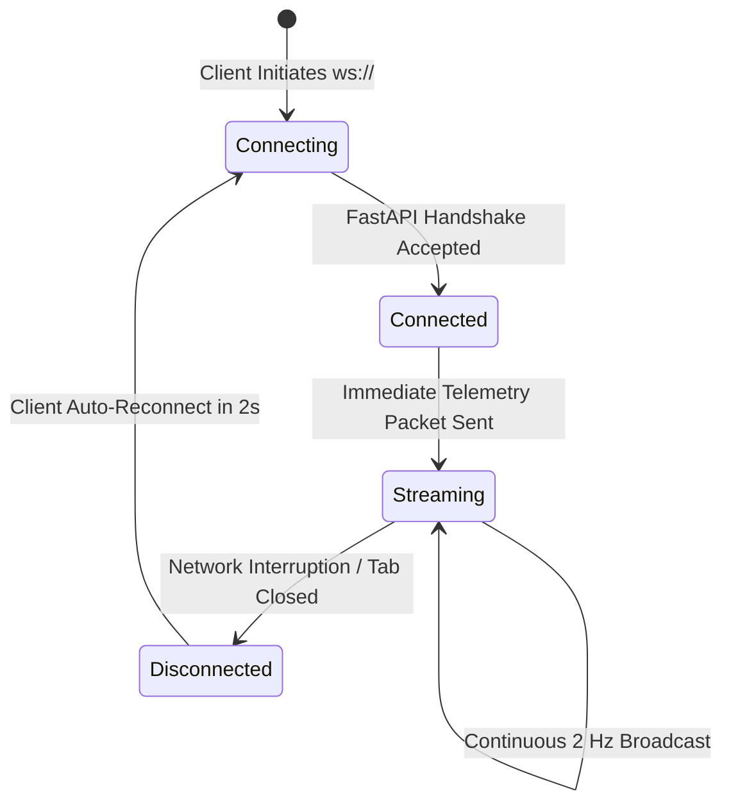

# VITA-BAND AI: Real-Time WebSocket Streaming Flow

**Project**: VITA-BAND AI  
**Team**: ALPHA MECHS  
**SIH Problem Statement ID**: SIH26198  

---

## 1. WebSocket Protocol & Lifecycle

The dashboard utilizes a persistent, bi-directional WebSocket connection mounted at `/ws/health-stream` to receive real-time biosignals without requiring page refresh.



---

## 2. Telemetry Payload Schema

Every WebSocket transmission contains a complete JSON packet adhering to `WebSocketTelemetryPayload`:

```json
{
  "timestamp": "2026-09-23T10:15:30.123456",
  "vitals": {
    "timestamp": "2026-09-23T10:15:30.123456",
    "heart_rate": 78.4,
    "spo2": 98.2,
    "temperature": 36.85,
    "humidity": 52.0,
    "activity": "resting",
    "fall_detected": false,
    "ecg_status": "normal",
    "emg_status": "normal",
    "battery_percentage": 94
  },
  "ecg_buffer": [0.05, 0.12, 0.95, -0.22, 0.35, "...(100 points)"],
  "emg_buffer": [12.4, 15.8, -8.3, 21.0, "...(100 points)"],
  "risk_assessment": {
    "timestamp": "2026-09-23T10:15:30.123456",
    "risk_level": "NORMAL",
    "risk_score": 12.0,
    "detected_risks": ["NORMAL_STATE"],
    "contributing_factors": {},
    "confidence": 0.94,
    "anomaly_flags": []
  },
  "recommendations": [
    {
      "id": "rec-a81f3b20",
      "timestamp": "2026-09-23T10:15:30.123456",
      "risk_category": "NORMAL_STATE",
      "urgency": "low",
      "title": "Target Physiological Stability",
      "guidance": [
        "All primary vital parameters are within stable target ranges.",
        "Maintain baseline hydration."
      ],
      "disclaimer": "Preventive guidance only; not medical diagnosis."
    }
  ],
  "active_alert": null,
  "simulation_state": {
    "scenario_type": "NORMAL",
    "active": false,
    "duration_seconds": 60,
    "elapsed_seconds": 0
  }
}
```

---

## 3. Resilience & Connection Management

- **Immediate Telemetry on Connect**: Rather than waiting for the next generator interval, the WebSocket manager sends the latest cached telemetry snapshot immediately upon connection.
- **Concurrent Asynchronous Broadcasting**: The server uses `asyncio.gather` across all registered client WebSockets, guaranteeing that slow or lagging clients never delay broadcasts to other subscribers.
- **Dead Connection Pruning**: Sockets that encounter errors during transmission are isolated and discarded gracefully without disrupting other active clients.
- **Exponential Backoff Auto-Reconnection**: The frontend client `TelemetryWebSocketClient` retries interrupted connections using exponential backoff ($1\text{s} \times 1.5^{\text{attempts}}$, capped at 5s) up to 20 attempts.
- **Manual Disconnect Safeguard**: When intentional disconnection is triggered (e.g. user navigation or testing), auto-reconnect timers are suppressed.
- **Keepalive Ping/Pong**: Clients can send `{"action": "ping", "timestamp": "..."}` and receive immediate `{"type": "pong", "timestamp": "...", "echo": "..."}` responses for latency monitoring and channel liveness.
- **Pre-Serialized JSON Optimization**: The streaming loop serializes the telemetry snapshot to JSON once (`model_dump_json()`), eliminating redundant Pydantic serialization overhead across multiple clients.

---

## 4. Verification & Testing

Execute the automated integration test suites to verify end-to-end WebSocket operation:

```bash
# 1. Run Pytest unit and integration test suite
python -m pytest tests/websocket/test_stream.py -v

# 2. Run Live end-to-end WebSocket integration test against running servers
python scripts/websocket_integration_test.py

# 3. Run Frontend WebSocket client lifecycle & auto-reconnect test
node scripts/test_frontend_ws_client.mjs
```

