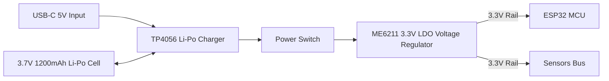

# VITA-BAND AI: Hardware Wiring & Sensor Connection Guide

**Project**: VITA-BAND AI  
**Team**: ALPHA MECHS  
**SIH Problem Statement ID**: SIH26198  

---

## 1. Master Wiring Matrix

All sensors interface with the ESP32 operating strictly at **3.3V logic** to protect the microcontroller input buffers:

| Sensor Module | Pin Name | ESP32 Connection | Pin Type | Notes |
| :--- | :--- | :--- | :--- | :--- |
| **AD8232 ECG** | 3.3V | `3V3` | Power | Regulated 3.3V supply |
| | GND | `GND` | Ground | System common ground |
| | OUTPUT | `GPIO36` (VP) | ADC1_CH0 | Analog cardiac potential |
| | LO+ | `GPIO34` | Digital In | Lead-Off positive indicator |
| | LO- | `GPIO35` | Digital In | Lead-Off negative indicator |
| | SDN | (Unconnected / 3V3)| Enable | Active high enable |
| **EMG Sensor** | +Vs | `3V3` | Power | Clean 3.3V rail |
| | GND | `GND` | Ground | System common ground |
| | SIG / OUT | `GPIO39` (VN) | ADC1_CH3 | Analog rectified muscle voltage |
| **MAX30102** | VIN | `3V3` | Power | 3.3V power |
| | GND | `GND` | Ground | Common ground |
| | SDA | `GPIO21` | I2C Data | Shared I2C bus (4.7kΩ pull-up to 3.3V) |
| | SCL | `GPIO22` | I2C Clock| Shared I2C bus (4.7kΩ pull-up to 3.3V) |
| | INT | `GPIO18` | Digital In | Interrupt line (optional) |
| **MPU6050 IMU** | VCC | `3V3` | Power | 3.3V power |
| | GND | `GND` | Ground | Common ground |
| | SDA | `GPIO21` | I2C Data | Shared I2C bus with MAX30102 |
| | SCL | `GPIO22` | I2C Clock| Shared I2C bus with MAX30102 |
| | AD0 | `GND` | Address | Sets I2C address to `0x68` |
| | INT | `GPIO19` | Digital In | Fall impact interrupt line |
| **DHT22** | VCC (Pin 1) | `3V3` | Power | 3.3V power |
| | DATA (Pin 2)| `GPIO4` | 1-Wire | Requires 10kΩ pull-up resistor to 3.3V |
| | NC (Pin 3) | Not Connected | - | Leave open |
| | GND (Pin 4) | `GND` | Ground | Common ground |

---

## 2. Power Supply & Battery Integration

- **Safety Protection**: Overcharge protection (4.2V cutoff) and over-discharge cutoff (2.5V) provided by the TP4056 protection circuitry.
- **Decoupling**: Place a 10µF tantalum capacitor in parallel with a 0.1µF ceramic capacitor across the 3.3V and GND rails near the AD8232 and MAX30102 to suppress switching noise.

---

## 3. Electrode Placement Guidelines

### 3.1 AD8232 ECG 3-Lead Electrode Placement
For accurate Einthoven Lead I / II signals with minimal muscle artifact:
1. **Red (RA - Right Arm)**: Right clavicle / upper chest just below the collarbone.
2. **Yellow (LA - Left Arm)**: Left clavicle / upper chest symmetric to RA.
3. **Green (RL - Right Leg / Reference Ground)**: Lower right abdomen / floating ground.

### 3.2 Surface EMG 3-Lead Electrode Placement
For detecting muscle fatigue and physical strain on the arm:
1. **Electrode 1 (Signal +)**: Mid-belly of the target muscle (e.g. flexor carpi radialis or biceps brachii).
2. **Electrode 2 (Signal -)**: Placed along the muscle fiber orientation 2–3 cm away from Electrode 1.
3. **Electrode 3 (Reference Ground)**: Bony prominence without muscle tissue (e.g. elbow olecranon or wrist styloid process).
